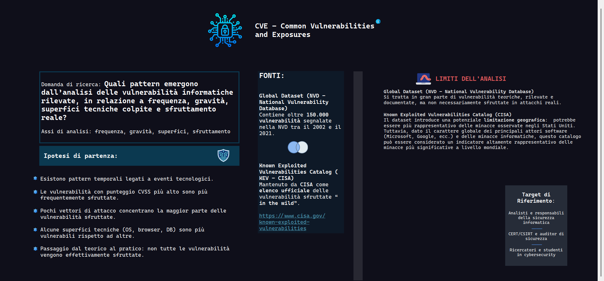
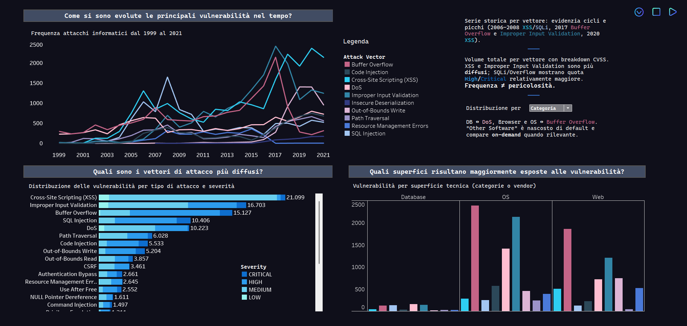
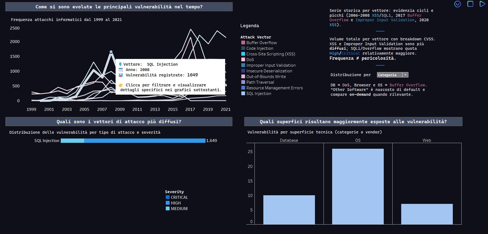
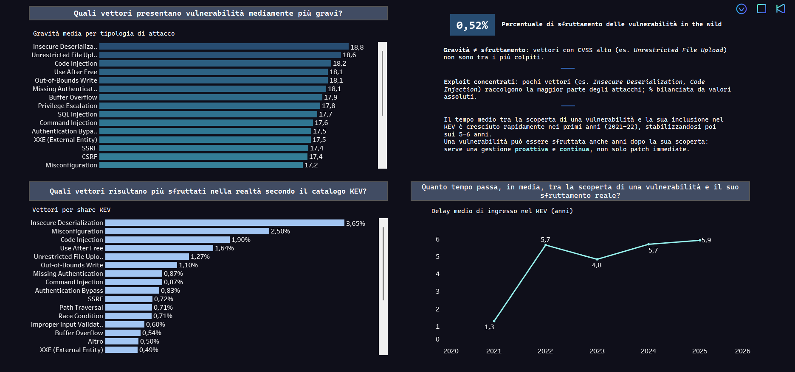
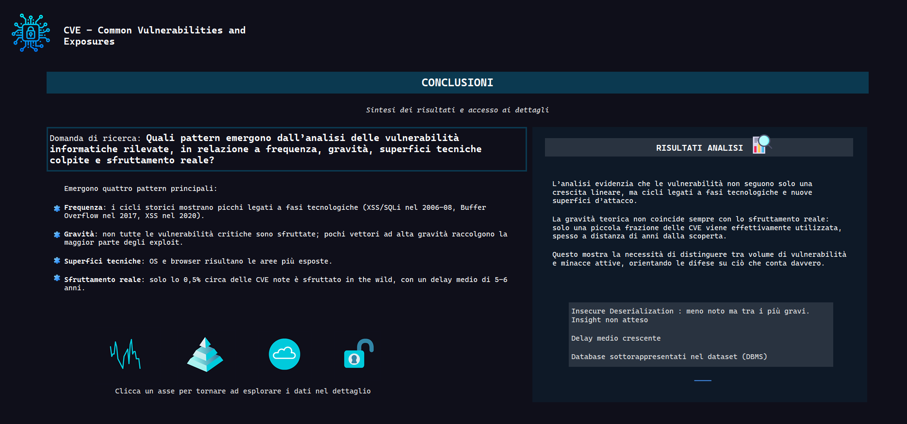

# 🔐 Software Vulnerabilities Analysis (CVE) — Tableau Interactive Dashboard

This project presents an in-depth, research-driven analysis of software vulnerabilities using data from the National Vulnerability Database (NVD) and the CISA Known Exploited Vulnerabilities (KEV) catalog.
The goal is to identify patterns in frequency, severity, technical exposure, and real-world exploitation of vulnerabilities — and to visualize these insights through a UX-friendly, interactive Tableau dashboard.

---
## 🎯 Research Question

What patterns emerge from the analysis of detected software vulnerabilities, in relation to frequency, severity, affected technical surfaces, and real-world exploitation?

The project investigates four analytical axes:

Frequency — historical cycles linked to technological shifts.

Severity — not all high-severity CVEs are exploited in practice.

Technical surfaces — OS, browsers, and databases appear more exposed.

Real-world exploitation — only ~0.5% of known CVEs are actually exploited in the wild.

---
## Methodology & Research Approach

This work is the result of a rigorous research process, focused on data quality, reproducibility, and interpretability.

1. Dataset Selection & Validation

Two authoritative sources were chosen:

NVD Global Dataset (2002-2021) — over 150,000 documented vulnerabilities.

CISA KEV Catalog — the official register of vulnerabilities known to be exploited in the wild.

The datasets were evaluated for:

completeness

temporal consistency

representativeness across vendors

potential biases (e.g., U.S.-centric reporting in CISA KEV)

2. Data Cleaning & Transformation

A meticulous preparation workflow was carried out:

normalization of vendor and product names

removal of duplicates and inconsistent CVE entries

standardization of CVSS vectors

extraction of severity categories

parsing and alignment of publication and exploitation dates

computed fields for exploitability, attack vectors, and time-to-exploit

The cleaning process was fundamental to ensure analytical reliability and avoid misleading trends.

3. UX-Centered Dashboard Design

The dashboard was intentionally structured to support progressive exploration, following the principle:

“Overview → Zoom & Filter → Details-on-Demand”

Key UX decisions include:

Top-right navigation menu to facilitate orientation and reduce cognitive load

Icon-based navigation in the final summary screen to reinforce iterative reading

Color-coded severity and attack vectors for instant pattern recognition

Consistent layout and spacing for a smooth analytical flow

The design aims to make a dense technical analysis accessible, intuitive, and visually coherent.

4. Interactivity & Guided Insights

Every chart includes:

Interactive filters for vectors, categories, and severity

Clickable elements to reveal granular details

Tooltip enhancements with metadata, timestamps, and contextual explanations

Cross-chart linking to help users compare and interpret multiple dimensions simultaneously

This transforms the dashboard from a static report into an exploratory analytical tool.

---
## Dashboard Overview
1. Vulnerability Trends Over Time

Historical evolution of key attack vectors (1999–2021)

Clear technological cycles (e.g., XSS/SQLi peaks 2006-2008, Buffer Overflow 2017, XSS 2020)

Frequency does not imply real-world danger — an important analytical distinction.

2. Most Frequent Attack Vectors

XSS, Improper Input Validation, and Buffer Overflow dominate historically

Severity breakdown shows that some frequent vectors are not the most dangerous

3. Most Exposed Technical Surfaces

OS and browser surfaces show the highest vulnerability concentration

Databases exhibit fewer vulnerabilities but often higher severity

4. Attack Vectors with the Highest Average Severity

Insecure Deserialization and Unrestricted File Upload rank among the most critical

Not all high-severity CVEs translate into actual exploitation

5. Real-World Exploitation Analysis (KEV)

Only 0.52% of vulnerabilities are confirmed exploited in the wild

Exploits cluster around a few vectors (Insecure Deserialization, Code Injection, Misconfiguration)

Time-to-exploit: average delay ranges between 4.8 and 5.9 years

Trend indicates a shrinking window of exposure in recent years (2021–2022)

6. Final Synthesis

The dashboard concludes with an iterative summary panel that helps the user:

revisit the analytical question

compare findings with the data

navigate back to detailed sections

Icons and micro-interactions support a smooth back-and-forth exploration.

---
## Main Findings

Vulnerabilities follow technological cycles, not linear growth.

High CVSS ≠ high likelihood of exploitation.

A small number of vectors account for the majority of real-world attacks.

OS and browser surfaces remain more exposed than others.

The delay between detection and exploitation is significant, emphasizing the need for continuous monitoring, not just immediate patching.

---

## 📂 Project Structure
/project.twbx                  ← Tableau workbook  
/data/                         ← cleaned + raw datasets   
/screenshots/                  ← dashboard visuals   

---

## Screenshots

   
   
   
   
   

---

## Author

**Mariella Rossi**  
Master’s student in Digital Information (LM-91).  
Interested in web development, data visualization, and digital technologies.

---

## Contacts

- GitHub: https://github.com/marielllup  
- Email: mariellarossi244@gmail.com
---
This project was created for educational purposes as part of my portfolio.
Please do not reuse without attribution.

